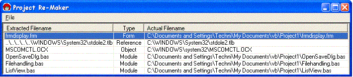



## Project1/Project Remaker

### Description

Copies all the files contained in a vb project file to one directory, then remakes the project file to point to it. Added frx, and now ctx (frx for usercontrols) file support.
 
### More Info
 

             |
---                |---
**Submitted On**   |2003-06-17 12:02:14
**By**             |[Techni Rei Myoko](https://github.com/Planet-Source-Code/PSCIndex/blob/master/ByAuthor/techni-rei-myoko.md)
**Level**          |Intermediate
**User Rating**    |4.8 (19 globes from 4 users)
**Compatibility**  |VB 6\.0
**Category**       |[Complete Applications](https://github.com/Planet-Source-Code/PSCIndex/blob/master/ByCategory/complete-applications__1-27.md)
**World**          |[Visual Basic](https://github.com/Planet-Source-Code/PSCIndex/blob/master/ByWorld/visual-basic.md)
**Archive File**   |[Project1\_P1602126172003\.zip](https://github.com/Planet-Source-Code/techni-rei-myoko-project1-project-remaker__1-42804/archive/master.zip)

